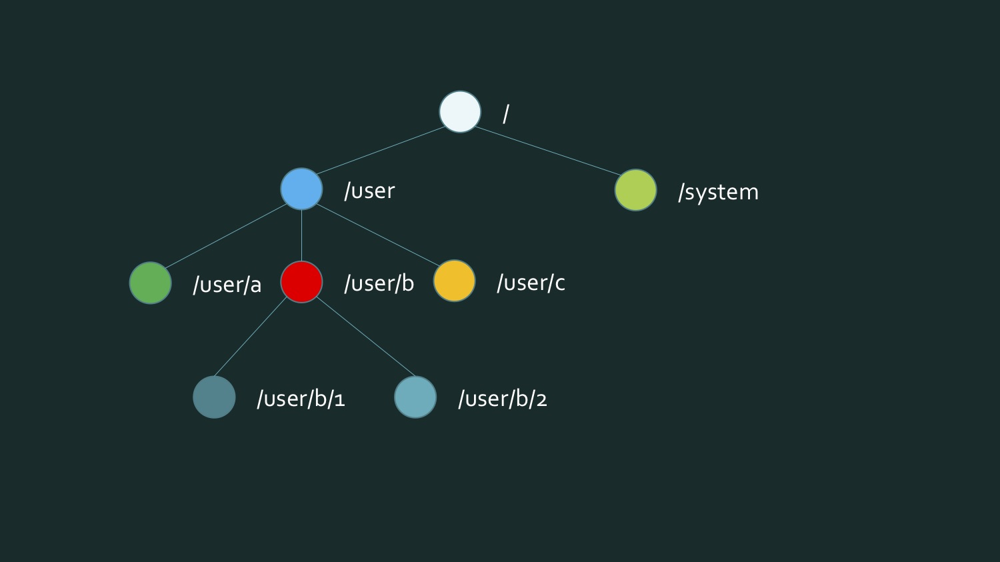
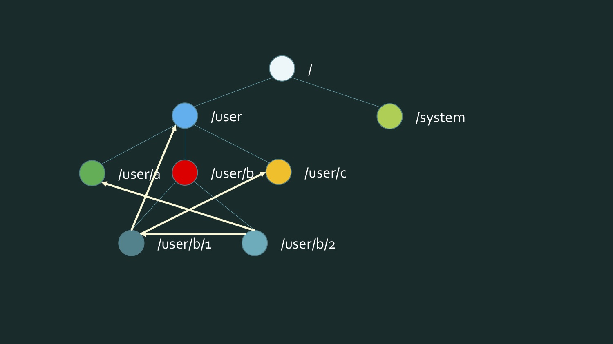

# Akka Streams

## Потоки

Поток выглядит следующим образом. Потребитель потребляет данные с некоторой пропускной способностью. Данные могут быть конечны, а могут быть бесконечны. Обычно потоки используются для чтения/записи из/в таких сущностей как файлы, сокеты, процессы и т.п.

Потоки могут усложняться. Например, автоматизированное управление производством можно представить как один большой композитный поток. 

Akka Streams - это высокоуровневая абстракция над потоками. Она позволяет:

- Ещё более абстрагироваться от параллельного программирования, даже выше, чем акторы;
- Создавать реактивные потоки (Reactive Streams);
- Использовать обратное давление (backpressure) для управления и динамического уточнения пропускной способности рабочего процесса.

*Reactive Streams - подход позволяющий применить функциональные примитивы(.map, .filter, .reduce) к чему-то распределенному по времени. Например, мы передаем по сети некий набор комманд – нам не нужно дожидаться пока мы получим весь набор, мы представляем его как reactive stream и можем с ним работать.*

*Идея обратного давления (Backpressure) очень важна в контексте Reactive Streams и сводится к тому, что мы ограничиваем объем данных, передаваемых между соседними звеньями конвейера, поэтому ни одно звено не переполняется. Поскольку важнейший аспект реактивного подхода – не допускать блокировок за исключением случаев, когда это совершенно необходимо, реализация обратного давления в реактивном потоке также должна быть неблокирующей.*


## Почему акторов иногда не хватает

Акторы хороши для решения задач, связанных с ручным управлением потоками, разделенным состоянием. Однако, они не компонуются. Например, такая модель:



При обмене сообщениями начнёт выглядеть так:



Проблема здесь в том, что в актор вшивается адрес его получателя, и в рантайме их не поменять. 

В основе акторов лежит метод `tell`, а возвращает `void`. Это однонаправленные сообщения, которые ничего не возвращают. Поэтому из цепочки акторов нельзя построить описание процесса.

На более высоком уровне мы заинтересованы выполнением запроса. Например, функциональной трансформацией данных.


## Akka Streams

Akka Streams - это одна из реализаций инициативы Reactive Streams. Эта библиотека позволяет компоновать программу на более высоком уровне, а акторы создаются и соединяются уже "под капотом". В Akka Streams любой Iterable может стать источником потока данных. 

В Akka есть готовые блоки, которыми легко пользоваться:

- Source (Источник данных) - стадия обработки с одним выходом;
- Sink (Сток) - стадия обработки с одним входом;
- Пропускной пункт (Flow) - стадия обработки с одним выходом и одним входом. Здесь происходят функциональные трансформации, причём необязательно в памяти: это может быть обращение к веб-сервису и прочее.

Из этих трёх типов можно формировать графы (Graph). Это сложные стадии обработки, которые построены из источников, стоков и пропускных пунктов. 

Граф является запускаемым (Runnable Graph), если он закрыт, т.е. на каждый выход есть выход. Если данные вошли - они обязательно должны куда-то выйти.

Пример графа на Scala:

```scala
var runnable = 
  Source
      .From(Enumerable.Range(1, 1000))
      .Via(Flow.Create<int>().Select(x => x * 2)
      .To(Sink.ForEach<int>(x => Console.Write(x.ToString));
```


Этот граф состоит из источника, пропускного пункта(GraphStage на рисунке) и стока. Для его запуска нужно создать систему акторов и в ней - материализатор (materializer), а в него передать граф:

```scala
var system = ActorSystem.Create("MyActorSystem");
using (var materializer = ActorMaterializer.Create(system))
{
    await runnable.Run(materializer);
}
```

