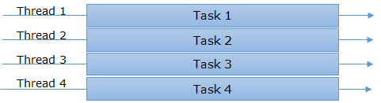

# Параллелизм, мнногопоточность, асинхронность

## Синхронная модель

Синхронная программная модель - потоку назначается одна задача и начинается выполнение. Когда завершено выполнение задачи - тогда выполняется следующая.

Однопоточность - если у нас есть несколько задач, а система имеет один поток, то задачи выполняются одна за другой.

Многопоточность - много потоков могут брать задачи одну за другой и работать над ними. Сколько потоков - столько и задач выполняется одновременно. Есть некоторый пул потоков. 

Потоки - это абстракция операционной системы. При работе с потоками нужно помнить о синхронизации - чтобы два потока не меняли какую-то память одновременно. Пока поток ждёт чего-то - он "блокирован".

Многопоточность не решает важную проблему: в реальности у нас зачастую больше задач, тем потоков. Некоторые задачи требуют неблокирования приложеняи (например, когда пользователь загружает файл, остальные части приложения должны быть активны). С другой стороны, если задача вычислительная - необходимо блокировать данные, которые используются в вычислении.

## Асинхронная модель

Один поток, начав выполнение задачи, может приостановить выполнение, сохранив текущее состояние, и начать другую задачу. Задачи чередуются друг за другом.

Много потоков могут работать в асинхронном режиме, одна задача может выполняться часть за частью разными потоками.

Например, задача 6 начата вторым потоком, а продолжена остальными. Здесь нужно задумываться о синхронизации этих потоков, разделении ресурсов и состояний, планировщике.

С другой стороны, это позволяет нам "просить выполнение" и не ждать его, а просто заниматься своими делами. Выполнение может завершиться успешно, неуспешно и по таймауту. Точно предсказать, когда будет выполнена задача - обычно нельзя.

## Параллелизм (Concurrency)

Это способ обработки множественных запросов одновременно. По сути, как многопоточность, так и асинхронность являются примерами параллельного программирования. Они подходят для решения различных задач. Асинхронность лучше подходит для операций ввода-вывода, а синхронность - для вычислений. Асинхронная модель менее предсказуема и сильно зависит от реализации планировщика и среды (например, JVM). Синхронная модель больше опирается на ядро операционной системы.

## Кооперативная модель

Кооперативная модель является чем-то средним. Она может работать как на потоках, так и на асинхронном выполнении. Однако, в ней мы сами *явно* решаем, когда переключать контекст (поток/асинхронный воркер), поэтому не требуется учитывать синхронизацию. Если они где-то нужны, они всё равно проще, ведь мы знаем все конкретные случаи обращения к проблемному участку.

Такие участки кода называются корутины (сопрограммы). Они имеют одну точку входа и несколько точек выхода.

### Модель акторов

Акторы - это модель кооперативных вычислений. В системе, построенной на акторах, есть всего две сущности - актор (адрес и состояние) и сообщение (данные). При получении сообщения актор может:

- Создать N новых акторов (эти акторы являются его детьми и известны ему);
- Отправить N сообщений известным акторам;
- Изменить своё состояние.

В такой модели не бывает блокировок кроме самого по себе ожидания результата. Акторы просто переиспользовать (они умеют только принимать сообщения, больше ничего), у него не может быть жёстких зависимостей (все акторы знают друг друга только по ссылкам) и неявных связей (акторы знают только детей и родителя, остальные адреса могут быть получены только сообщением). 

Кроме того, у каждого актора ещё есть очередь сообщений (на неё расходуются ресурсы, зато легко определить "отстающий" актор).

Сами акторы, при этом, могут работать как в разных потоках, так и асинхронно.

**Источники:**
https://habr.com/ru/post/337528/
https://habr.com/ru/post/318374/
https://habr.com/ru/post/318786/
https://habr.com/ru/post/319350/
